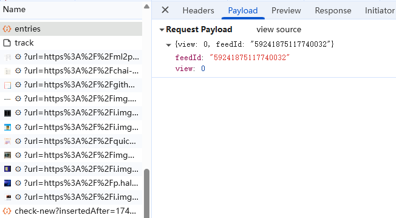
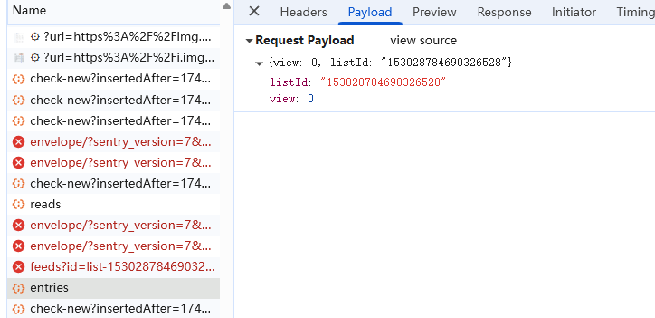

## 项目部署与维护

### 🏗️ 项目架构

本项目依托 Cloudflare 强大的生态系统，实现了高效、轻量与良好的可扩展性。

> 各核心组件协同工作，构成了一个从数据输入、处理到输出的完整闭环。

*   **☁️ Cloudflare Workers**: 作为项目的**核心执行环境**，负责处理所有 HTTP 请求、调度任务、调用外部 API 以及执行 AI 内容生成逻辑。
*   **🗄️ Cloudflare KV**: 作为项目的**持久化存储**，用于保存配置信息、缓存数据以及每日生成的报告内容，提供了低延迟的键值对存储能力。
*   **🔌 外部 API 整合**:
    *   **AI 模型 API**: 集成 Google Gemini 和 OpenAI 兼容 API，为内容摘要和再创作提供强大的 AI 支持。
    *   **内容源 API**:
        *   **Folo API**: 默认的信息聚合来源，可灵活配置抓取不同的 Folo 源。
        *   **GitHub Trending API**: 获取 GitHub 每日热门项目，追踪开源趋势。
    *   **发布渠道 API**:
        *   **GitHub API**: 用于将处理好的内容自动推送到指定的 GitHub 仓库。
*   **🛠️ Wrangler**: Cloudflare官方的命令行工具，用于项目的本地开发、环境配置和一键部署。

### 🚀 快速开始

#### 1. 准备工作

首先，请确保您的开发环境中已安装 Node.js 和 npm。

- **安装 Wrangler CLI**:
  ```bash
  npm install -g wrangler
  或
  npm install -g @cloudflare/wrangler
  ```

- **克隆项目代码**:
  ```bash
  git clone https://github.com/justlovemaki/CloudFlare-AI-Insight-Daily.git
  cd CloudFlare-AI-Insight-Daily
  ```

#### 2. 配置环境变量

项目的核心配置均在 `wrangler.toml` 文件中完成。请根据您的需求修改 `[vars]` 部分的配置。

> **注意**：使用 `**` 标记的为 **必填项**。

```toml
# wrangler.toml

# 项目名称
name = "ai-insight-daily" 
# Worker 入口文件
main = "src/index.js" 
# 兼容性日期
compatibility_date = "2024-05-20"
# 在开发模式下是否启用 Worker，设置为 true 可以在 workers.dev 子域上预览。
workers_dev = true

[vars]
# ========================
# 基础功能配置
# ========================
**LOGIN_USERNAME** = "your_login_username"
**LOGIN_PASSWORD** = "your_login_password"
DAILY_TITLE = "AI洞察日报"
PODCAST_TITLE = "来生小酒馆"
PODCAST_BEGIN = "嘿，亲爱的V，欢迎收听新一期的来生情报站，我是你们的老朋友，何夕2077"
PODCAST_END = "今天的情报就到这里，注意隐蔽，赶紧撤离"

# ========================
# AI 模型配置
# ========================
# 可选值: "GEMINI" 或 "OPEN"
**USE_MODEL_PLATFORM** = "GEMINI" 
OPEN_TRANSLATE = "true"

# Gemini 配置
**GEMINI_API_KEY** = "your_gemini_api_key"
GEMINI_API_URL = "https://generativelanguage.googleapis.com"
DEFAULT_GEMINI_MODEL = "gemini-2.5-flash-preview-05-20"

# OpenAI 兼容 API 配置 (如 DeepSeek)
OPENAI_API_KEY = "your_openai_compatible_key"
OPENAI_API_URL = "https://api.deepseek.com"
DEFAULT_OPEN_MODEL = "deepseek-chat"

# ========================
# GitHub 发布配置
# ========================
**GITHUB_TOKEN** = "your_github_personal_access_token"
**GITHUB_REPO_OWNER** = "your_github_username"
**GITHUB_REPO_NAME** = "your_repo_name"
**GITHUB_BRANCH** = "main"

# ========================
# 内容源配置 (按需配置)
# ========================
# Folo 源
FOLO_COOKIE_KV_KEY = "folo_auth_cookie"
FOLO_DATA_API = "https://api.follow.is/entries"
FOLO_FILTER_DAYS = "1"

# 其他内容源 ID 和抓取页数...
AIBASE_FEED_ID = "......" 
AIBASE_FETCH_PAGES = "2" 
XIAOHU_FEED_ID = "......" 
XIAOHU_FETCH_PAGES = "2" 
HGPAPERS_FEED_ID = "......"
HGPAPERS_FETCH_PAGES = "2" 
TWITTER_LIST_ID = "......"
TWITTER_FETCH_PAGES = "2" 
```

#### 3. 本地开发与调试

- **配置 KV 命名空间**:
  1.  在 Cloudflare 控制台 > `Workers 和 Pages` > `KV` 中创建一个新的 KV 命名空间。
  2.  将创建的 KV ID 添加到 `wrangler.toml` 文件中：
      ```toml
      kv_namespaces = [
        { 
            binding = "DATA_KV",  # 代码中使用的绑定名称
            id = "your_kv_namespace_id"  # 在 Cloudflare 控制台找到的 ID
        }
      ]
      ```

- **启动本地开发服务**:
  ```bash
  wrangler dev
  ```
  该命令会启动一个本地服务器（通常在 `http://localhost:8787`），您可以直接在浏览器中访问以进行调试。

- **默认开始路径**:
  * 路径：/getContentHtml?date=YYYY-MM-DD (GET) 

#### 4. 部署到 Cloudflare

- **登录 Cloudflare**:
  ```bash
  wrangler login
  ```

- **一键部署**:
  ```bash
  wrangler deploy
  ```
  部署成功后，Wrangler 会返回一个公开的 `*.workers.dev` 域名，您的 AI 洞察日报服务已在线上运行！

### 🗓️ 定时生成日报站点 (可选)

#### 方案一：🌐 使用 GitHub Actions 自动部署 (推荐)

此方案利用 GitHub 的免费资源，实现全自动、零成本的日报站点部署，是大多数用户的首选。

> **📌 前置要求**：
> *   您的目标 GitHub 仓库已开通 GitHub Actions 功能。
> *   在仓库的 `Settings` -> `Pages` 中，选择 `GitHub Actions` 作为部署源 (Source)。
> *   确保 `.github/workflows/` 目录下已包含 `build-daily-book.yml` 等工作流文件。

##### 部署步骤

1.  **🔧 配置工作流文件**
    *   打开 `.github/workflows/build-daily-book.yml` 文件，找到所有涉及到 `book` 分支的地方，将其修改为您计划用于存放日报站点的分支名称（例如 `gh-pages`）。
    *   (可选) 修改文件顶部的定时任务时间，以自定义每日执行时间

2.  **🔧 调整mdbook配置文件**
    *   打开 `book.toml`文件，
    *   修改 `title` 为您的日报站点标题。
    *   修改 `git-repository-url` 为您的 GitHub 仓库地址。

3.  **💡 (可选) 配置图片代理**
    如果遇到部署后图片无法显示的问题，可以配置一个图片代理来解决。
    *   在您的 GitHub 仓库页面，进入 `Settings` -> `Secrets and variables` -> `Actions`。
    *   在 `Variables` 标签页，点击 `New repository variable`。
    *   创建一个名为 `IMAGE_PROXY_URL` 的变量，值为您的代理服务地址，例如 `https://your-proxy.com/`。

4.  **🚀 触发 Action 并验证**
    *   手动触发一次 `build-daily-book` 工作流，或等待其定时自动执行。
    *   任务成功后，稍等片刻，即可通过您的 GitHub Pages 地址访问。
    *   访问地址格式通常为：`https://<你的用户名>.github.io/<你的仓库名>/today/book/`

---

#### 方案二：🐳 使用 Docker 进行本地或服务器部署

此方案适合希望将日报站点部署在自己服务器或本地环境的用户，拥有更高的控制权。

##### 部署步骤

1.  **📝 修改配置文件**
    在 `cron-docker` 目录下，您需要根据自己的情况修改以下文件：

    *   **`Dockerfile`**:
        *   修改 GITHUB相关变量 为您自己的 GitHub 仓库地址。
        *   (可选) 修改 `ENV IMAGE_PROXY_URL` 为您的图片代理地址。
        *   (可选) 修改第6步的 `cron` 表达式，以自定义每日执行时间 (默认为 UTC 时间)。

    *   **`修改默认分支`**:
        *   打开`scripts/build.sh`，修改第四步git clone -b book "$REPO_URL"，调整为你的分支
        *   打开`scripts/work/github.sh`，修改BRANCH="book"，调整为你的分支

    *   **`scripts/work/book.toml`**:
        *   修改 `title` 为您的日报站点标题。
        *   修改 `git-repository-url` 为您的 GitHub 仓库地址。

2.  **🛠️ 构建并运行 Docker 容器**
    在您的终端中执行以下命令：

    ```bash
    # 进入 cron-docker 目录
    cd cron-docker

    # 构建 Docker 镜像，并命名为 ai-daily-cron-job
    docker build -t ai-daily-cron-job .

    # 在后台以守护进程模式 (-d) 启动容器
    docker run -d --name ai-daily-cron -p 4399:4399 --restart always ai-daily-cron-job
    ```
    > **提示**：`-p 4399:80` 命令会将容器的 80 端口映射到主机的 4399 端口，您可以根据需要修改主机端口。

3.  **✅ 验证部署**
    打开浏览器，访问 `http://127.0.0.1:4399`。如果能看到生成的日报站点，则表示本地部署成功。

4.  **🌐 (可选) 配置公网访问**
    如果您需要让外网也能访问到这个站点，可以将您的服务器端口暴露到公网。推荐使用 [Cloudflare Tunnels](https://www.cloudflare.com/products/tunnel/) 等工具，可以安全、便捷地实现内网穿透。

### ❓ F.A.Q

#### 如何获取 `feedId` 和 `listId`？

-   **Folo Feed ID**: 登录 Folo.so 后，在浏览器地址栏中找到 `feedId`。
    

-   **Twitter List ID**: 在 Twitter 上打开您想关注的列表，`listId` 就在地址栏中。
    

#### 🔑 如何获取 API 密钥？

-   **Google Gemini API Key**:
    访问 [Google AI for Developers](https://ai.google.dev/gemini-api/docs/api-key?hl=zh-cn) 创建您的 API 密钥。

-   **GitHub Personal Access Token**:
    请参照 [GitHub 官方文档](https://docs.github.com/zh/authentication/keeping-your-account-and-data-secure/managing-your-personal-access-tokens) 生成一个具有 `repo` 权限的 Token。